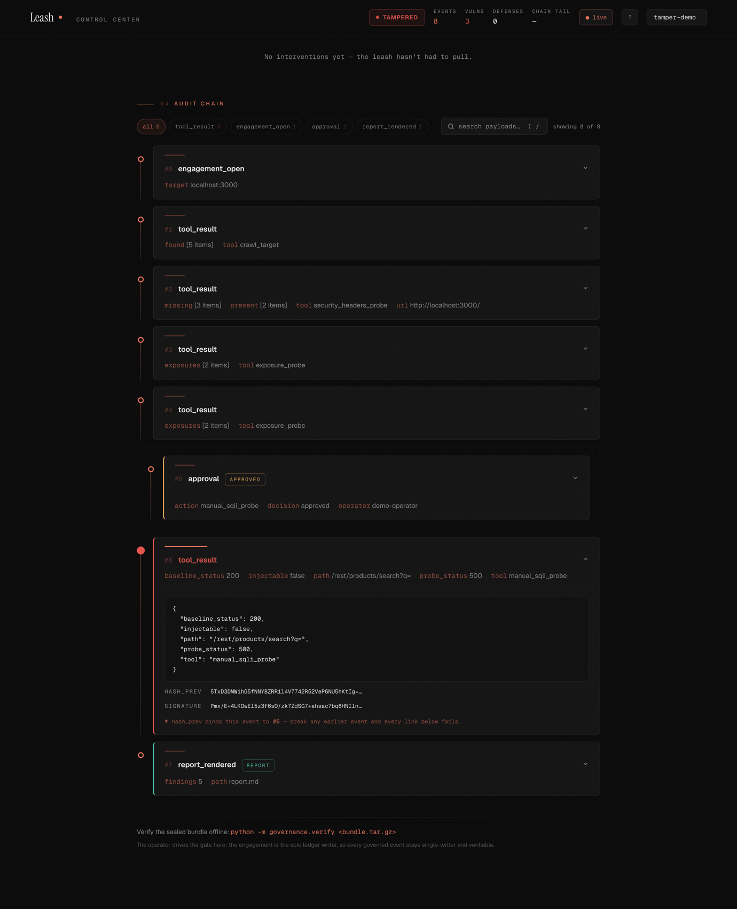

# Leash 🐕‍🦺

**A swarm of offensive-security agents that coordinates through [Band](https://band.ai) — recruiting specialists on discovery, handing off by `@mention`, with a human in the room.**

Point it at a target and a **Commander agent runs the engagement inside a Band room**: it recruits a Recon Scout, and the moment recon surfaces an attack surface it pulls the matching specialist *into the room live* — every handoff an `@mention`, every agent holding its own seat the human can watch. **Band is the coordination plane.** Because the whole swarm runs *through* it, Leash can wrap that coordination in a **scope leash, a human approval gate, and a tamper-evident audit trail** — which is what makes an autonomous offensive swarm safe to run unsupervised.

> Built for the **Band of Agents Hackathon** (lablab.ai, Jun 2026) by Team Roan — Josh Langsam ([@joshualangsam-a11y](https://github.com/joshualangsam-a11y)) & Augie Barreirinhas ([@AugieBarr](https://github.com/AugieBarr)).


---

## Why Leash

Autonomous pentest is already a crowded field — 39+ open-source agents, XBOW topping HackerOne, HexStrike-AI driving 150+ tools. But the field has a hole everyone names and nobody fills: **governance.** XBOW's own CISO calls it a *"chaos phase… we are not ready,"* with agents *"dropping your tables."* The tools optimize for autonomous execution over audit trails or scope enforcement.

Leash is the **governed** swarm — the anti-HexStrike. The bold move is *where* the governance lives: not bolted on after the fact, but **inside the Band room**, as a property of how the agents coordinate. Band gives it exactly the controls the field lacks:

| Field's gap | What Leash does on Band |
| --- | --- |
| No scope enforcement | A fail-closed scope guard + a ScopeWarden agent that issues each specialist a restricted capability it cannot exceed |
| No audit trail | Every governed action is hash-chained (Ed25519) into a tamper-evident ledger by a single writer and sealed into a verifiable bundle — an in-process chain, so it holds even if Band drops |
| "Dropping your tables" | A **human approval gate** before any destructive action, and a Commander kill-switch that ejects the swarm |
| Static recon→scan→exploit pipelines | **Dynamic recruit-on-discovery** — recon finds a SQLi surface and the SQLi specialist joins the room live |

All offensive activity targets **deliberately-vulnerable, authorized lab targets only** (OWASP Juice Shop). Scope enforcement is a hard, built-in gate — not an afterthought.

## Who it's for

A security-engineering lead whose SOC 2 or PCI-DSS program has to produce a penetration-test evidence package every quarter — proof of exactly what was tested, when, and who authorized each exploit step. Today that record is assembled by hand and trusted because the operator says so. Leash emits it as a byproduct: an Ed25519-signed, hash-chained bundle the customer or auditor can verify cold, with only the public key shipped inside it — **no trust in the operator required.** The governance core is a clean-room port of a production Elixir audit system (`DiogenesCore.AuditLog`), not hackathon scaffolding.

---

## Architecture

```
                  BAND CASE ROOM  (every agent holds a persistent WebSocket; the human sees all)
  TIER 0  Human Operator — approves exploitation; holds the kill-switch; reads the live audit stream
  TIER 1  BRAIN AGENTS        Commander · ScopeWarden · Auditor
  TIER 2  SPECIALISTS         Recon Scout · SQLi Hunter · Reporter
                              (recruited into the room per discovery)
  TIER 3  WORKER TOOL-JOBS    http_probe · crawl · sqlmap · ffuf  (semaphore-bounded fan-out)
```

Band's `@mention` routing means a 30-agent room never floods every agent — each wakes only when called — so the tiered swarm *fits* Band rather than fighting it.

---

## The governance core

The differentiator is implemented first and runs entirely offline (no Band, no API keys):

- [`governance/audit_ledger.py`](governance/audit_ledger.py) — Ed25519-signed, SHA-256 hash-chained, append-only ledger. Chain hash: `SHA256(seq_be64 ‖ kind ‖ hash_prev ‖ payload ‖ sig)`. Any post-hoc edit breaks verification.
- [`governance/scope_guard.py`](governance/scope_guard.py) — fail-closed allowlist; off-target calls never execute. Path-boundary aware and `..`-normalized, so a `/rest/products` cap can't be escaped by `/rest/products-evil` or `/rest/products/../admin`.
- [`governance/capability.py`](governance/capability.py) — restricted child capabilities (parent ∩ restriction; empty → deny-all).
- [`governance/bundle.py`](governance/bundle.py) — seals the verified ledger + public key into a portable, third-party-verifiable bundle (cross-checks the manifest's tail hash + event count against the re-derived chain).

The trust boundaries are stated explicitly — what's enforced in code, what assumes single-process colocation, and what stops if Band drops — in [`THREAT_MODEL.md`](THREAT_MODEL.md).

Quick proof that tampering is detectable:

```bash
uv run pytest tests/test_audit_ledger.py -v
```

---

## Live Control Center

Leash ships a zero-dependency **operator Control Center** ([`viewer/`](viewer/)) — a live dashboard served straight from the Python standard library (no framework, nothing to install):

- **Drive the engagement from the browser.** The human approval gate and the kill-switch are *operated from the UI*. When a specialist requests an exploitation step the gate opens; the operator clicks **Approve** or **Halt**, and the **Kill Switch** is live the whole time.
- **Watch vulnerabilities land.** A severity-ranked findings feed surfaces each confirmed issue as it is discovered — SQL injection, security misconfiguration, sensitive exposure — with OWASP class, endpoint, and evidence, derived live from the audit stream.
- **See the swarm.** A roster shows all six agents + the operator with live status (idle / engaged / active / awaiting approval / halted).
- **Verify as it streams.** The chain-tail hash and a VERIFIED / TAMPERED badge are re-derived on every append by the same authority as the offline verifier; click any event to inspect its payload, `hash_prev`, and signature.

Crucially, **the operator's own clicks are governed.** The viewer never writes to the ledger — a second writer would break the single-writer hash chain. Instead a click drops a decision file that the engagement (the sole ledger writer) picks up and records as a signed `approval` / `kill_switch` event. So *who approved what* is itself bound into the tamper-evident chain.

It needs no API key — the same control channel that serves the live Band swarm also drives a paced, real-target demo:

```bash
# terminal 1 — the operable Control Center
python -m viewer.viewer --engagement control-demo
# terminal 2 — the paced engagement (real recon + a live, web-driven approval gate)
python scripts/control_demo.py
# then open http://localhost:8089/?engagement=control-demo and hit APPROVE / HALT
```

**Prove the trail cannot be rewritten.** Fork a sealed engagement, alter a single already-signed event, and watch it get caught — the Ed25519 signature no longer matches the mutated payload, so the chain names the exact event and the viewer renders it red:

```bash
python scripts/tamper_demo.py                       # flips one signed event → "TAMPERED — bad signature at seq N"
python -m viewer.viewer --engagement tamper-demo    # the viewer flips VERIFIED → TAMPERED and lights that event red
```



Detection needs only the public key shipped in the bundle — never the private key. That is the whole trust thesis, made visible.

---

## Quickstart

```bash
# 1. Stand up the authorized lab target
docker compose up -d juice-shop      # OWASP Juice Shop on http://localhost:3000

# 2. Python env (uv)
uv sync --extra dev

# 3. Governance tests (offline — no Band, no API key needed)
uv run pytest -v

# 4. Band credentials (per agent, registered once at app.band.ai)
cp env.example .env                  # Band URLs; no ANTHROPIC_API_KEY needed by default
cp agent_config.example.yaml agent_config.yaml   # then fill agent_id + api_key per agent

# 5. Run the live swarm through Band — keyless, on your local Claude subscription
python -m swarm.launcher --engagement-id demo-01 --seed --brain-only
```

The default adapter (`LEASH_ADAPTER=claude_sdk`) drives the agents on the local `claude` binary's subscription auth, so **no `ANTHROPIC_API_KEY` is required**; set `LEASH_ADAPTER=anthropic` (and `ANTHROPIC_API_KEY`) only if you prefer a raw key. `.env` and `agent_config.yaml` are gitignored — secrets never get committed.

---

## Scale

The "1000-agent" headline refers to the worker-job fan-out layer — demonstrated with a real benchmark and a connection harness in [`scale_test/`](scale_test/), stated honestly and never faked. Measured this build:

- `worker_fanout_bench --workers 1000 --cap 16` → **1000/1000 jobs** complete, **peak concurrency 16** (cap never exceeded), ~1,305 jobs/s.
- `worker_fanout_bench --workers 200 --target http://localhost:3000` → **200/200 real scope-guarded probes** against the live target, peak 16.
- `connect_harness` → **6/6 live Band WebSockets** held from one host.

These worker jobs are coroutines, not 1000 live WebSocket agents — the worker layer scales toward 1000 concurrent **tasks** by distributing across machines, while full 1000-*agent* WS scale needs Band's enterprise tier, with no change to the architecture. [`scale_test/README.md`](scale_test/README.md) spells out exactly what each number proves and does not prove.

---

## Status

Day-4 build. Two things are true, and kept deliberately separate:

**Governance + tooling — verified offline, no API key, no Band.** The full governed pipeline runs deterministically ([`scripts/offline_demo.py`](scripts/offline_demo.py)) and confirms **three real vulnerability classes** on live Juice Shop: recon maps the surface → **security misconfiguration** (missing CSP/HSTS, A05) and **sensitive exposure** (open `/ftp`, version disclosure, A01/A05) → ScopeWarden issues a `/rest/products`-scoped capability → the SQLi hunter reaching for `/ftp` is **blocked by the scope guard** (fail-closed) → the **human approval gate** (enforced inside the tool, not by prompt) → SQLi **confirmed** (`q=apple'` → HTTP 500) → Auditor **seals a tamper-evident bundle** that verifies offline. **61/61 tests green** (tamper-detection, path-boundary + `..`-traversal scope bypasses, the cap-never-exceeded scale invariant, fail-closed scoping, kill-switch refusal, and the code-enforced approval gate). This pipeline is **in-process Python — it does not go through Band**; it is an honest proof of the governance layer.

**Band integration — the live swarm coordinates through Band, with no API key.** It runs keyless on the local Claude subscription (default `LEASH_ADAPTER=claude_sdk`, via the `claude` binary; `anthropic` switches to a raw key). Verified live against Juice Shop: all six agents connect (6/6); the launcher seeds the room and the **Commander recruits specialists on discovery** through a coded `recruitspecialist` tool — observed live recruiting the Recon Scout (recorded as a `recruited` event), after which ScopeWarden issued its capability and the recruited scout ran real probes. Every action lands in the same tamper-evident chain, which **verifies after the live run** (`Chain OK — N events, no tampering`). The deeper exploit → approve → seal arc is driven by the demos below and by the **same in-tool gate the live swarm uses**.

**Governance primitives, honestly scoped.** The **approval gate** is enforced *inside the exploitation tools* ([`tools/sqli_tools.py`](tools/sqli_tools.py)) — `manual_sqli_probe` / `run_sqlmap` block on the operator's APPROVE / HALT and record the approval to the chain, so it cannot be bypassed by a non-compliant LLM (offline runs pre-authorize; the live swarm and Control Center block on the browser). The **kill-switch** is real, not a prompt — `Engagement.halt()` makes every offensive tool refuse in-process and audits the refusal; a companion script ([`swarm/kill_switch.py`](swarm/kill_switch.py)) ejects participants Band-side. The **scale layer** ([`scale_test/`](scale_test/)) holds the concurrency cap (peak 16/16 over 1000 jobs), runs 200 real scope-guarded probes, and holds 6/6 live Band WebSockets. The **Reporter** emits a real deliverable — executive summary, severity rollup, findings table, and an Ed25519 audit attestation.

Reproduction — with Juice Shop on `localhost:3000`:

```bash
python scripts/offline_demo.py     # governance pipeline, in-process (no Band, no key)
python -m governance.verify engagements/offline-demo/offline-demo_bundle.tar.gz
# live swarm through Band — no key; Commander recruits specialists on discovery:
python -m swarm.launcher --engagement-id demo-01 --seed --brain-only
```

The day-by-day to submission (Jun 19) lives in [`docs/BUILD_PLAN.md`](docs/BUILD_PLAN.md).

## License

MIT — see [LICENSE](LICENSE).
